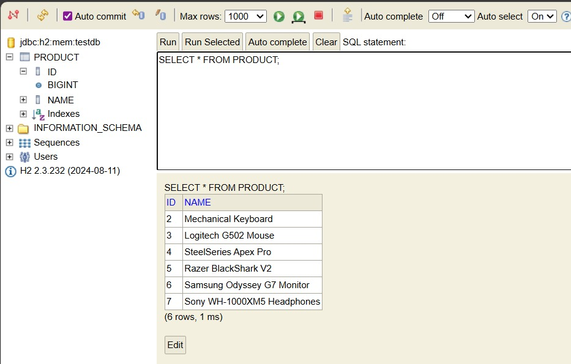

# Product Management REST API

This repository contains a Spring Boot application that provides a RESTful API for managing product information. It demonstrates a simple and effective implementation of CRUD (Create, Read, Update, Delete) operations using Spring Web, Spring Data JPA, and an in-memory H2 database.

---

## 📸 System Preview

| API Documentation (Swagger UI) | Live Database (H2 Console) |
| :---: | :---: |
|  |  |

> **Note:** The screenshots above demonstrate the API in action (left) and the real-time data persistence in the H2 database (right), including sample data like "Mechanical Keyboard" and "Gaming Mouse."

---

## Features

* **Create** a new product.
* **Retrieve** a specific product by its ID.
* **Retrieve** a list of all products.
* **Update** an existing product's details.
* **Delete** a product by its ID.
* **API Documentation** with Swagger UI.
* **Centralized Exception Handling**.

---

## 🚀 Use Case Descriptions

* **Inventory Onboarding:** Administrators utilize the `POST /api/v1/product` endpoint to register new hardware items, such as "Mechanical Keyboards" or "Gaming Mouses," directly into the catalog.
* **Real-time Stock Audit:** Managers can execute a `GET` request or access the H2 Console to view a live snapshot of current inventory, ensuring data accuracy.
* **Catalog Maintenance:** The system facilitates the removal of placeholder data (e.g., initial test entries) and the modification of product names as inventory evolves using `PUT` and `DELETE` operations.
* **Error Resilience & UX:** The API provides graceful error handling. If a user requests a non-existent ID, the system returns a clear `404 Not Found` message, preventing client-side confusion and system instability.

---

## Technologies Used

* **Java 17**
* **Spring Boot 3**
* **Spring Data JPA**
* **Maven**
* **H2 In-memory Database**
* **Springdoc OpenAPI (Swagger UI)**

---

## Getting Started

Follow these instructions to get the project up and running on your local machine.

### Prerequisites

* **JDK 17** or later
* **Apache Maven**

### Installation & Running

1.  **Clone the repository:**
    ```sh
    git clone [https://github.com/TuanBulut/TughanbulutProj2v2.git](https://github.com/TuanBulut/TughanbulutProj2v2.git)
    cd tughanbulutproj2v2
    ```

2.  **Run the application using Maven:**
    ```sh
    mvn spring-boot:run
    ```
    The application will start locally on `http://localhost:8080`.

---

## API Documentation

This project uses Springdoc OpenAPI to generate interactive documentation. Once the application is running, you can explore and test all endpoints here:

* **Swagger UI:** [http://localhost:8080/swagger-ui.html](http://localhost:8080/swagger-ui.html)

---

## API Endpoints

The base path for the API is `/api/v1/product`.

| Method | Endpoint | Description | Success Response |
| :--- | :--- | :--- | :--- |
| `POST` | `/` | Creates a new product | `201 CREATED` |
| `GET` | `/{id}` | Finds a product by ID | `302 FOUND` |
| `GET` | `/` | Gets all products | `200 OK` |
| `PUT` | `/{id}` | Updates a product by ID | `200 OK` |
| `DELETE`| `/{id}` | Deletes a product by ID | `204 NO CONTENT` |

### Error Handling

If a product is not found for a given ID, the API returns a structured JSON error:

```json
{
  "message": "Product not found with id {id}"
}
```

## Database

The application uses an in-memory H2 database. The data is volatile and will be reset every time the application restarts.

The H2 database console is enabled and can be accessed to view the database schema and data.

*   **H2 Console URL:** [http://localhost:8080/console/](http://localhost:8080/console/)
